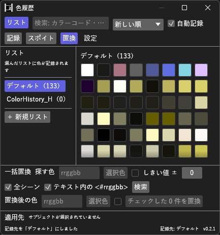

# ColorHistory_H マニュアル



**ColorHistory_H** は、オブジェクトで使った色を覚えておき、クリックでカラーコードをコピーしたり、選択中のオブジェクトへそのまま適用したりできる色履歴プラグイン（Rust 製 `.aux2`）です。色を**リスト**に分けて残せるほか、画面の色を拾う**スポイト**と、プロジェクト内の色の**一括置換**があります。

- **バージョン:** 0.2.3（2026-10-10: 開いても出てこなかった編集メニューの「色履歴を開く」を外した。表示メニューから開きます）
- **作者:** by HexBrowns
- **必要環境:** AviUtl2 **2.1.10** 以上

本体の「パレット」（1 つ 64 色まで）は使わず、プラグイン専用のファイルに記録します。件数は設定した上限まで増やせます。

---

## 開き方

- **表示** メニュー → **色履歴**（ウィンドウ配置パネルからも選択可）

表示リストに出ない場合は AviUtl2 を再起動してください。

## 導入

1. [Releases](https://github.com/HexBrowns/ColorHistory_H/releases) から `HexBrowns.ColorHistory_H-v0.2.2.au2pkg.zip` をダウンロードし、AviUtl2 のプレビューへドラッグ&ドロップする
   （手で置くなら、中の `Plugin` フォルダをデータフォルダ `C:\ProgramData\aviutl2` へコピーする。`Plugin\ColorHistory_H\ColorHistory_H.aux2` が置かれます）
2. AviUtl2 を再起動する（起動中に置いた場合も、再起動するまで読み込まれません）
3. **表示** メニュー → **色履歴** でウィンドウを開く

v0.2.1 までは zip を展開して置く形でした。上書きで入れ替えて構いません（履歴と設定はそのまま使えます）。

### ビルド（開発者向け）

リポジトリのルートで [aviutl2-cli](https://github.com/sevenc-nanashi/aviutl2-cli) の `au2` を実行します。
`release/` に、AviUtl2 のプレビューへドラッグ&ドロップして導入できるパッケージ（`.au2pkg.zip`）ができます。

```powershell
au2 release
```

---

## 画面の構成

| 位置 | 内容 |
|------|------|
| 上 | **リスト**（左の一覧の表示切り替え）、検索欄、並び順、**自動記録**、**記録**、**スポイト**、**置換**、**設定** |
| 左 | **リスト**の一覧と **＋ 新規リスト** |
| 中央 | **ピン留め（件数）** と **選んでいるリスト名（件数）** の色見本 |
| 下 | **一括置換**（**置換** を押したときだけ）、**適用先** と **選択色を適用**、ラベル編集欄（編集中のみ）、状態表示と **記録先** |

色見本の右上の点は**ピン留め**、左下の短い線は**ラベルあり**の印です。

## 使い方

### 1. リストを選ぶ

色は**リスト**ごとに分けて残せます。最初は **デフォルト** だけがあります。

- 左の一覧で**クリックしたリストが記録先**になります。以後に記録した色はそのリストにだけ入ります（他のリストには入りません）
- 中央に出るのも、選んでいるリストの色です。右下の **記録先:** にリスト名が出ます
- **＋ 新規リスト**: 新しいリストを作り、そのまま記録先にします。名前の欄が開くので、入力して Enter（または欄の外をクリック）で確定、Esc で「新しいリスト」のまま
- リストを**右クリック** → **名前を変更** / **リストを削除**（削除は **もう一度押すと削除** に変わるので、3 秒以内にもう一度押す）
- **デフォルト** は名前の変更・削除ができません。記録先のリストを削除すると、記録先はデフォルトに戻ります

使い方の例: 案件ごとにリストを作って選んでおくと、「この案件ではこういう色を使った」が残ります。

### 2. 色を記録する

**自動記録**（既定 ON）: オブジェクト設定などで**色を変えると**、その色が記録先のリストに入ります。

- **変えた色だけ**を記録します。オブジェクトを選んだだけでは記録しません
- 色設定ウィンドウで色をドラッグして探している間は記録せず、**マウスを離して色が約 0.5 秒変わらなくなった時点**の色を 1 つだけ記録します（途中の色で埋まらないように）
- 透明色は記録しません
- 同じ色は重複させず、使用回数と最後に使った時刻を更新します

**手動で記録する:**

- **記録** ボタン: 選択中オブジェクトの色項目の色を、いまの値ですべて記録します
- **編集** メニュー → **色履歴: 選択中オブジェクトの色を記録**: 同じ動作です。**ショートカットキーを割り当てられます**（左上メニューの「ショートカットキーの設定」）
- **設定** → **色を追加**: カラーコードを入力して **追加**（または Enter）。`ff8000` / `#ff8000` / `0xff8000` / `<#ff8000>` / `255,128,0` のどれでも読めます

### 3. スポイトで画面の色を拾う

オブジェクトの色は**変えずに**、画面上の色を記録先のリストへ入れるだけのスポイトです。

**ボタンから:**

1. **スポイト** ボタンを**押したまま**、拾いたい場所（プレビューなど）までドラッグする
2. ボタンの下に、いまカーソルの下にある色が出る
3. **離した位置の色**が記録される（離す前に **Esc** で中止）

ボタンをクリックしただけでは何も起きません（ドラッグして使います）。

**ショートカットから:**

- **編集** メニュー → **色履歴: カーソル位置の色を記録**。ショートカットキーを割り当てておくと、カーソルを色の上に置いてキーを押すだけで記録できます

拾うのは**画面に表示されている色**です。プレビューの縮小・なめらかな縁・半透明の重なりの影響を受けるので、オブジェクトに設定した値と少しずれることがあります。正確な値が要るときは **記録** を使ってください。

### 4. 色を使う

**クリック**: その色を選択し、カラーコードをクリップボードへコピーします（既定は `rrggbb`）。オブジェクト設定の色項目のカラーコード欄などへ貼り付けて使います。

**右クリック** で次のメニューが出ます。

| 項目 | 内容 |
|------|------|
| **コピー: …** | 形式を選んでコピー（`rrggbb` / `#rrggbb` / `<#rrggbb>` / `0xrrggbb` / `r,g,b`） |
| **選択中オブジェクトへ適用** | 選択中オブジェクトの色項目を選んで、その色を書き込む |
| **リストへコピー** | 別のリストへ色を写す（ラベルとピン留めも写す。元のリストからは消さない） |
| **ピン留め** / **ピン留めを外す** | ピン留めの切り替え |
| **ラベルを編集** | 下にラベル編集欄が出る。**保存** か Enter で確定、**やめる** で取り消し |
| **このリストから消す** | その色をいま選んでいるリストから削除 |

- `<#rrggbb>` はテキストオブジェクトの色の制御文字、`0xrrggbb` は Lua スクリプトに書く形式です
- **Ctrl+C**: 選択中の色をコピー（色履歴のウィンドウを操作しているとき）
- 色見本にマウスを重ねると、カラーコード・ラベル・RGB・HSV・使用回数・最後に使った時期・最後に使った場所（「テキスト / 文字色」など）が出ます

### 5. 選択中オブジェクトへ直接適用する

1. タイムラインでオブジェクトを選ぶ
2. 下の **適用先** で色項目を選ぶ（「テキスト / 文字色（ffffff）」のように現在値が出ます）
3. 色見本をクリックして選択
4. **選択色を適用**

- 書き込みは **AviUtl2 本体の「元に戻す」で取り消せます**
- 同じ名前のエフェクトが複数あるときは「縁取り:1 / 縁色」のように何番目か（0 始まり）が付きます
- 適用した色は「使った色」として記録先のリストの先頭へ移ります

### 6. プロジェクト内の色を探して一括置換する

上の **置換** を押すと、下に **一括置換** の欄が開きます。

1. **探す色** にカラーコードを入れる（**選択色** で、いま選んでいる色見本の色を入れられます）
2. **しきい値 ±** を決める（下の表）
3. **全シーン** と **テキスト内の <#rrggbb>** を必要に応じて切り替える（どちらも既定 ON）
4. **検索** を押すと、見つかった箇所が一覧になります（「シーン名　L レイヤー　開始〜終了 f　場所　見つかった色」）
5. 置き換える箇所にチェックを入れる（**すべて選択** / **選択解除** もあります）
6. **置換後の色** を入れて、**チェックした N 件を置換**

| しきい値 | 同じ色とみなす範囲 |
|----------|------------------|
| **0**（既定） | 完全に一致する色だけ |
| **1** | R・G・B それぞれの差が 1 以下（`808080` を探すと `7f8180` も見つかる） |
| **N** | 各成分の差が N 以下（最大 64） |

少しずつずれてしまった同系色を 1 つの色にまとめるときは、しきい値を 1〜数程度にして検索します。

- 置換は **1 回の「元に戻す」でまとめて取り消せます**
- 置換する直前に値を読み直し、**検索したあとに変わっていて条件に合わなくなった箇所は触りません**（状態表示に件数が出ます）
- 置換したあとは自動で検索し直します。置き換えた色は記録先のリストに入ります
- **テキスト内の <#rrggbb>**: テキストオブジェクトの本文にある `<#rrggbb>` / `<#rrggbb,rrggbb>` の色も探して置き換えます。`<#>`（色を戻す）は対象外です
- レイヤー番号とフレーム番号は、タイムラインの表示と同じ 1 始まりで出ます

**他のシーンについて:**

- **置換できるのは、いま表示しているシーンだけです。** 他のシーンの箇所は灰色で「（保存データ・置換不可）」と出て、チェックできません。そのシーンを表示してから検索し直すと置換できます
- 他のシーンは**最後に保存した `.aup2` の内容**から探します。保存していない変更は反映されません。プロジェクトを一度も保存していないときは、他のシーンは探しません

### 7. ピン留めとラベル

- **ピン留め**した色は上の **ピン留め** の欄に並び、**件数の上限を超えても消えません**
- ピン留めした色にラベルを付けると、見本の横にラベルが出ます
- ラベルは検索の対象になります
- ピン留めとラベルはリストごとです

### 8. 並び替えと検索

| 並び順 | 内容 |
|--------|------|
| **新しい順**（既定） | 最後に使った順 |
| **使用回数順** | 使った回数が多い順（同数なら新しい順） |
| **色相順** | 赤→黄→緑→青→紫。灰色など彩度の低い色は最後に明るい順 |

検索欄にはカラーコードの一部（`#` や `0x` は付けても付けなくてもよい）、ラベルの一部、`r,g,b` を入れられます。検索と並び順は、いま選んでいるリストに効きます。

## 設定

**設定** ボタンで開きます。

| 項目 | 範囲 | 初期値 | 説明 |
|------|------|--------|------|
| **件数の上限** | 16〜10000 | 500 | **1 つのリストあたり**の、ピン留めしていない色の最大件数。超えたら、最後に使ったのが古い色から消えます |
| **見本の大きさ** | 16〜64 | 28 | 色見本 1 個の大きさ（px） |
| **クリックでコピーする形式** | — | rrggbb（カラーコード欄） | クリックと Ctrl+C でコピーする形式 |
| **色を追加** | — | — | カラーコードを入力して記録先のリストへ追加 |
| **このリストのピン留め以外を消去** | — | — | 押すと **もう一度押すと消去** に変わり、3 秒以内にもう一度押すと消去。消えるのは選んでいるリストだけで、ピン留めは残ります |

並び順・**自動記録**・選んでいるリストも保存されます。

## 保存先

- `Plugin\ColorHistory_H\history.json`（**全プロジェクト共通で 1 つ**。すべてのリストがこのファイルに入ります）
- 変更から約 1 秒後、プロジェクト保存時、AviUtl2 終了時に書き出します
- ファイルが壊れていて読めないときは、`history.broken-<数字>.json` に退避してから空の状態で始めます（上書きしません）
- v0.1.0 で記録した履歴は、v0.2.0 で読み込んだときに **デフォルト** へ移ります

---

## PaletteHistory との違い

ColorHistory_H は、`PaletteHistory.aux2` の代わりとして作りました。`PaletteHistory.aux2` は、オブジェクトを選んだときに本体の編集処理へ割り込むため、**その操作の「元に戻す」が効かなくなる**ことがあります（`reset_frame_selection_on_focus.aux2` も同じ）。
ColorHistory_H は色を**読み取るだけ**で記録するので、この問題は起きません。本体へ書き込むのは **選択色を適用** と **チェックした N 件を置換** を押したときだけです。

- PaletteHistory の履歴（`history.palette`）を取り込む機能はありません。使っていた色は **設定** → **色を追加** で入れてください
- 本体のパレット機能（色設定ウィンドウのパレット）とは連動しません

## 注意事項・既知の制限

- 記録されるのは、選択中（フォーカス中）の 1 オブジェクトの色だけです。複数選択した他のオブジェクトの色は記録しません
- 自動記録は、同じオブジェクトを選んだまま色を変えたときに働きます。色を変えてから確定する前に別のオブジェクトを選んでも、変えた色は記録されます
- 元に戻す（本体）で色が戻った場合も、戻った色は「使った色」として記録されます
- ウィンドウを閉じていても記録は続きます。色を読むのは本体で何か変えたときだけで、同じオブジェクトの間は色の項目だけを読みます（v0.2.2）
- 透明色から黒へ（または黒から透明色へ）変えたときは、記録が 2 秒ほど遅れることがあります（本体がこの 2 つを同じ値で返すため、間をおいて確かめ直します）
- 一括置換で置き換えられるのは、表示中のシーンの色項目と、テキスト本文の `<#rrggbb>` です。スクリプト制御欄など、それ以外の文字列の中に書かれた色は探しません

### 確認済み（2026-10-03、本体 2.1.11a）

次の動作を AviUtl2 2.1.11a で確かめました。うまくいかない場合は教えてください。

- オブジェクト設定のカラーコード欄に、コピーした `rrggbb` を貼り付けられる
- 色設定ウィンドウで色を変えたときに、自動記録が働く
- スポイトを色履歴のウィンドウの外までドラッグして離しても、本体側に余計なクリックが伝わらない
- 一括置換で、スクリプトの色の項目（`--color@`）とテキスト本文の `<#rrggbb>` が検索に出てくる
